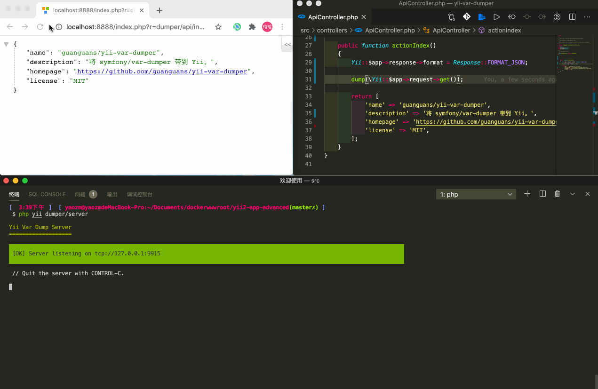
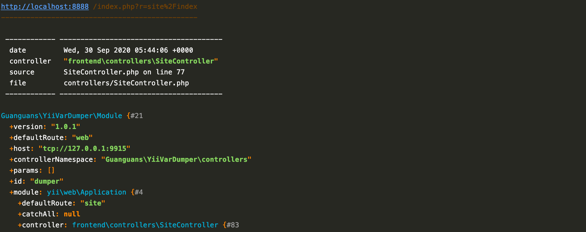
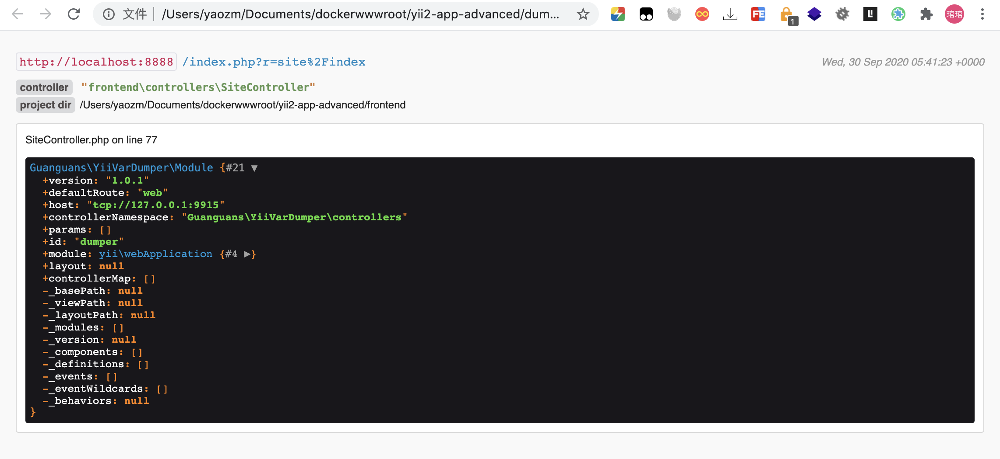

# yii-var-dumper




[](https://travis-ci.org/guanguans/yii-var-dumper)
[](https://github.styleci.io/repos/299001049?branch=master)
[](//packagist.org/packages/guanguans/yii-var-dumper)
[](//packagist.org/packages/guanguans/yii-var-dumper)
[](//packagist.org/packages/guanguans/yii-var-dumper)

> Bringing the [symfony/var-dumper](https://symfony.com/components/VarDumper) to Yii.

## Requirement

* Yii >= 2.0

## Installation

``` bash
$ composer require guanguans/yii-var-dumper --dev -v
```

## Configuration

Config `config/main.php` file add:

``` php
...
'bootstrap' => [
    ...
    'dumper',
    ...
],
'modules' => [
    ...
    'dumper' => [
        'class' => 'Guanguans\YiiVarDumper\Module',
        // 'host' => 'tcp://127.0.0.1:9913',
    ],
    ...
],
...
```

## Usage

### Run `dumper/server`

``` bash
$ php yii dumper/server
```

### You can set the output format to HTML using the --format option:

``` bash
$ php yii dumper/server --format=html > dump.html
# or
$ php yii dumper/server -f=html > dump.html
```

### Dump your variate

``` php
<?php
dump($yourVariate);
```

### Output result





## Testing

``` bash
$ composer test
```

## Related Links

* [https://github.com/symfony/var-dumper](https://github.com/symfony/var-dumper), by [symfony](https://github.com/symfony)
* [https://github.com/beyondcode/laravel-dump-server](https://github.com/beyondcode/laravel-dump-server), by [beyondcode](https://github.com/beyondcode)

## License

[MIT](LICENSE)
